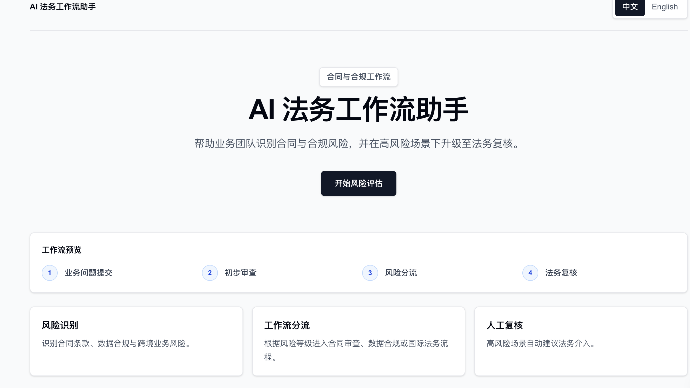
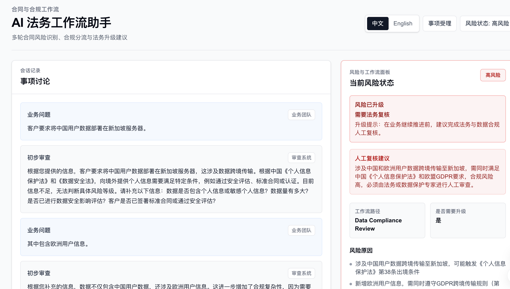
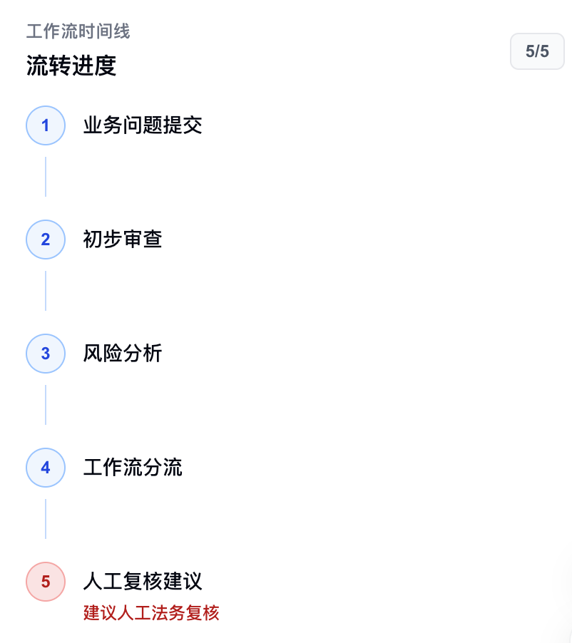

# AI Legal Workflow Assistant
Built for enterprise legal operations and compliance workflow exploration.
## Overview

AI Legal Workflow Assistant is an enterprise-style legal workflow tool designed for initial contract and compliance risk review.

The product helps business teams submit legal or compliance-related business requests, receive an initial review, identify missing information, assess risk level, and route matters into the appropriate legal workflow. High-risk scenarios are clearly flagged for human legal review.

This project is built as a demo-ready internal workflow product, not a consumer chatbot.

## Problem Statement

Business teams often need fast legal triage before moving forward with contracts, data processing requests, overseas customer deals, NDA reviews, or commercial terms.

Common challenges include:

- Legal teams receive incomplete requests.
- Business users may not know which facts are legally relevant.
- Risk level can change as new information is added.
- High-risk matters need clear escalation to human legal review.
- Legal intake workflows are often fragmented across messages, documents, and manual review queues.

AI Legal Workflow Assistant addresses these issues by providing a structured workflow layer for legal intake, risk review, and routing.

## Workflow

The core workflow is:

1. Business Question Submitted
2. Initial Review
3. Risk Assessment
4. Workflow Routing
5. Human Legal Review Recommendation

The assistant supports multi-turn workflow conversations. As the business team adds more context, the system updates the risk state and highlights whether the matter has escalated.

Example:

- Round 1: A client requests overseas data deployment.
- Initial result: Medium Risk
- Round 2: The business team adds that European user data is involved.
- Updated result: High Risk
- Workflow route: Data Compliance Review
- Recommendation: Legal Review Required

## Features

- Multi-turn workflow conversation
- Dynamic risk escalation tracking
- Risk level badge: Low, Medium, High
- Risk movement display, such as Medium to High
- Missing information detection
- Follow-up questions for incomplete requests
- Workflow routing by issue type
- Human review recommendation for high-risk scenarios
- Enterprise-style risk and workflow dashboard
- Chinese and English UI language support
- Server-side DeepSeek API integration
- No database or login system required

## Demo Scenarios

The product is optimized for enterprise contract and compliance workflows, including:

- NDA review
- Cross-border data transfer
- Overseas customer contracts
- GDPR-related data processing
- Auto-renewal clauses
- Payment liability clauses
- User data processing authorization
- Contract review routing
- Data compliance review routing
- International legal review routing

Example business request:

> The client requests deploying user data on overseas servers and wants broad data processing authorization plus an auto-renewal clause in the master services agreement.

The workflow can identify risks related to:

- Data transfer jurisdiction
- Personal information processing
- Sensitive data exposure
- Contractual liability allocation
- Renewal and termination rights
- Human legal review requirements

## Design Philosophy

This project is designed as an internal enterprise workflow tool rather than a general-purpose AI chat interface.

The UI emphasizes:

- Calm and professional visual design
- Clear workflow hierarchy
- Low-noise information layout
- Structured legal intake
- Risk-first decision support
- Human review for high-risk matters
- Enterprise SaaS interaction patterns

The product avoids:

- Consumer chatbot styling
- AI mascots
- Complex animations
- Decorative gradients
- Overly casual AI language
- Replacing legal judgment with automated conclusions

## Tech Stack

- Next.js App Router
- React
- TypeScript
- Tailwind CSS
- DeepSeek Chat Completions API
- Server-side API route for model calls
- Lightweight custom i18n dictionary
- Browser session storage for conversation state

## Security Design

The DeepSeek API key is never exposed to the frontend.

Security decisions include:

- API calls to DeepSeek are made only from the server route.
- The frontend calls the internal Next.js API route.
- API credentials are read from server-side environment variables.
- No `NEXT_PUBLIC` API key is used.
- `.env`, `.env.local`, and `.env*.local` are ignored by Git.
- Missing server environment variables are handled with a clear server-side error.
- The project does not store user requests in a database.

Required environment variables:

```bash
DEEPSEEK_BASE_URL=
DEEPSEEK_API_KEY=
DEEPSEEK_MODEL=
```

## Local Setup

Install dependencies:

```bash
npm install
```

Create a local environment file:

```bash
touch .env.local
```

Add DeepSeek configuration:

```bash
DEEPSEEK_BASE_URL=
DEEPSEEK_API_KEY=
DEEPSEEK_MODEL=
```

Run the development server:

```bash
npm run dev
```

Open the app:

```bash
http://localhost:3000
```

Run lint:

```bash
npm run lint
```

Build for production:

```bash
npm run build
```

## Deployment

This project can be deployed as a standard Next.js application.

Deployment requirements:

- Configure the same DeepSeek environment variables in the deployment platform.
- Do not expose the API key as a public environment variable.
- Ensure the API route runs server-side.
- Confirm `.env.local` is not committed to the repository.

For Vercel deployment, configure:

```bash
DEEPSEEK_BASE_URL
DEEPSEEK_API_KEY
DEEPSEEK_MODEL
```

Then deploy through the Vercel dashboard or CLI.

## Current Status

Current implementation includes:

- Enterprise-style homepage
- Contract and compliance workflow positioning
- Multi-turn conversation state
- Risk state display
- Dynamic risk escalation UI
- Missing information panel
- Follow-up question support
- Workflow routing panel
- Human legal review recommendation
- Chinese and English UI language switch
- Server-side DeepSeek API integration
- API key safety checks
- Lint passing state

The project is suitable for portfolio, resume, and interview demonstration purposes.

## Future Exploration

Potential future directions include:

- Structured intake forms for different legal workflows
- Exportable legal review summaries
- Workflow queue simulation
- Matter status tracking
- Role-based views for business and legal teams
- Contract clause extraction
- Integration with document upload workflows
- Audit trail for review decisions
- Configurable workflow routing rules
- More granular risk taxonomy
- Legal team approval and resolution states
## Live Demo

Deployed on Vercel:
https://ai-legal-workflow-assistant.vercel.app
## Screenshots

### Homepage



### Risk Escalation



### Workflow Routing

